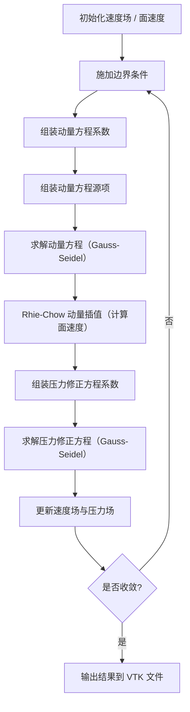

# IncompFlow-CUDA

**GPU 加速的不可压缩稳态流动求解器** | 结构化同位网格 | 有限体积法 | SIMPLE 算法

[](https://opensource.org/licenses/MIT)
[](https://developer.nvidia.com/cuda-toolkit)
[](https://en.cppreference.com/w/cpp/20)
[-lightgrey.svg)]()

---

## 项目简介

IncompFlow-CUDA 是一个基于有限体积法（FVM）的不可压缩 Navier–Stokes 方程稳态求解器。整个求解过程在 **NVIDIA GPU** 上完成——包括网格循环、系数组装、线性方程组求解等全部计算步骤均以 CUDA 内核实现，避免了 CPU/GPU 之间的频繁数据传输，从而显著提高计算效率。

求解器采用 **结构化同位网格（collocated grid）** 布局，使用 **SIMPLE 算法** 处理压力-速度耦合问题，并结合 **Rhie–Chow 动量插值** 消除棋盘格压力振荡现象。同时支持二维和三维流动的模拟，所有运行参数均可通过单个头文件灵活配置。

---

## 核心特性

| 类别 | 方法 / 实现 |
|------|------------|
| 控制方程 | 稳态不可压缩 Navier–Stokes 方程 |
| 空间离散 | 有限体积法（FVM），结构化同位网格 |
| 对流项格式 | 一阶迎风格式（upwind） |
| 扩散项格式 | 中心差分格式（二阶精度） |
| 压力–速度耦合 | **SIMPLE** 算法 + **Rhie–Chow 动量插值** |
| 线性求解器 | Point Jacobi / **Gauss–Seidel** 迭代法（默认 Gauss–Seidel） |
| 维度支持 | 2D / 3D（通过 `dim` 参数切换，编译期决定） |
| 硬件加速 | 全 CUDA 内核实现（网格循环、系数计算、迭代求解） |
| 输出格式 | VTK 格式（ASCII，`RECTILINEAR_GRID`），可用 ParaView 可视化 |
| 精度 | 单精度浮点（`float`），可修改 `include/types.h` 切换为双精度 |

---

## 算法细节

### 控制方程

求解器求解以下稳态不可压缩 Navier–Stokes 方程：

- **连续性方程**：$\nabla \cdot \mathbf{u} = 0$
- **动量方程**：$\rho(\mathbf{u} \cdot \nabla)\mathbf{u} = -\nabla p + \mu \nabla^2 \mathbf{u}$
- **能量方程**（待开发）：$\rho c_p(\mathbf{u} \cdot \nabla T) = k \nabla^2 T$

其中 $\rho$ 为密度，$\mu$ 为动力粘度，$k$ 为导热系数，$c_p$ 为比热容。

### SIMPLE 算法流程



### 离散化方法

- **对流项**：一阶迎风格式，利用面速度方向确定上游单元值
- **扩散项**：中心差分格式，利用相邻单元中心的梯度计算扩散通量
- **梯度计算**：基于格林-高斯定理的面通量求和

### Rhie–Chow 动量插值

在同位网格中，速度和控制体中心共享同一位置，直接线性插值面速度会导致压力场的奇偶失耦（"棋盘格"现象）。Rhie–Chow 插值通过在面速度计算中加入相邻单元的压力梯度修正项来有效避免该问题。具体实现见 `include/kernels.cuh` 中的 `RhieChowInterpolateKernel` 函数。

### 线性求解器

求解器提供两种迭代线性求解器：

- **Point Jacobi**（逐点雅可比迭代）：简单但收敛速度较慢
- **Gauss–Seidel**（高斯-赛德尔迭代）：收敛速度更快，**当前为默认选项**

两种求解器均直接在 GPU 上以内核函数实现，并支持亚松弛（under-relaxation）加速收敛。

---

## 项目结构

```
IncompFlow-CUDA/
├── include/
│   ├── config.h          # 所有运行参数（网格、物理、边界条件、求解参数）
│   ├── constants.h       # 方向索引、面积等编译期常量
│   ├── types.h           # 浮点类型定义（默认 float）
│   ├── Solver.h          # Solver 类声明
│   └── kernels.cuh       # 全部 CUDA 内核函数
├── src/
│   └── Solver.cu         # Solver 类实现（含 solve() 主流程）
├── main.cpp              # 主程序入口
├── CMakeLists.txt        # CMake 构建配置
├── LICENSE               # MIT 许可证
└── README.md             # 本文件
```

---

## 安装

### 系统要求

- **GPU**：NVIDIA GPU，计算能力 6.0 及以上（GTX 1060、RTX 2060、Tesla P100/V100/A100 等）
- **操作系统**：Linux（推荐 Ubuntu 18.04 及以上）
- **编译器**：支持 C++20（g++ 9+ / clang 12+）
- **CMake**：3.20 及以上
- **CUDA Toolkit**：11.0 及以上

### 安装 CUDA（以 Ubuntu 为例）

```bash
# 下载并安装 CUDA 11.8（可替换为更新版本）
wget https://developer.download.nvidia.com/compute/cuda/repos/ubuntu2204/x86_64/cuda-ubuntu2204.pin
sudo mv cuda-ubuntu2204.pin /etc/apt/preferences.d/cuda-repository-pin-600
wget https://developer.download.nvidia.com/compute/cuda/11.8.0/local_installers/cuda-repo-ubuntu2204-11-8-local_11.8.0-520.61.05-1_amd64.deb
sudo dpkg -i cuda-repo-ubuntu2204-11-8-local_11.8.0-520.61.05-1_amd64.deb
sudo cp /var/cuda-repo-ubuntu2204-11-8-local/cuda-*-keyring.gpg /usr/share/keyrings/
sudo apt-get update
sudo apt-get -y install cuda
```

添加 CUDA 到环境变量（`~/.bashrc`）：

```bash
export PATH=/usr/local/cuda-11/bin:$PATH
export LD_LIBRARY_PATH=/usr/local/cuda-11/lib64:$LD_LIBRARY_PATH
```

### 安装构建工具

```bash
sudo apt update
sudo apt install build-essential cmake git
```

---

## 获取代码

```bash
git clone https://github.com/WanZijun271/IncompFlow-CUDA.git
cd IncompFlow-CUDA
```

---

## 编译

CMake 会自动检测你的 GPU 计算能力，无需手动指定 `-DCUDA_ARCH`。

```bash
# 配置（生成 build 目录）
cmake -B build -DCMAKE_BUILD_TYPE=Release

# 编译
cmake --build build -- -j$(nproc)
```

编译成功后，可执行文件 `app` 位于项目根目录下的 `bin/` 文件夹中。

若需重新编译（例如修改 `config.h` 后），可运行：

```bash
cmake --build build --clean-first -- -j$(nproc)
```

或直接删除 `build` 和 `bin` 目录后重新执行上述两步。

---

## 配置算例

**所有运行参数均在 `include/config.h` 头文件中定义**。修改后需要重新编译。

### 完整配置参数说明

#### 维度与网格

| 参数 | 类型 | 说明 | 默认值 |
|------|------|------|--------|
| `dim` | `int` | 维度：`2` 表示二维，`3` 表示三维 | `2` |
| `nx` | `int` | X 方向网格数 | `512` |
| `ny` | `int` | Y 方向网格数 | `128` |
| `nz` | `int` | Z 方向网格数（2D 时设为 `1`） | `1` |
| `xmin`, `xmax` | `scalar` | X 方向计算域范围 | `-0.0625`, `0.0625` |
| `ymin`, `ymax` | `scalar` | Y 方向计算域范围 | `-0.0125`, `0.0125` |
| `zmin`, `zmax` | `scalar` | Z 方向计算域范围 | `0.0`, `1.0` |

#### 物理参数

| 参数 | 类型 | 说明 | 默认值 |
|------|------|------|--------|
| `density` | `scalar` | 流体密度 $\rho$ (kg/m³) | `998.2`（水） |
| `dynamicViscosity` | `scalar` | 动力粘度 $\mu$ (Pa·s) | `1.002e-3`（水） |
| `thermalConductivity` | `scalar` | 导热系数 $k$ (W/(m·K)) | `0.598`（水） |
| `specificHeatCapacity` | `scalar` | 比热容 $c_p$ (J/(kg·K)) | `4186.0`（水） |
| `thermalDiffusivity` | `scalar` | 热扩散率 $\alpha = k/(\rho c_p)$，**自动计算** | 由上述参数导出 |

#### 速度边界条件（`velBCs`）

| 参数 | 类型 | 说明 |
|------|------|------|
| `type[6]` | `int[6]` | 各面边界类型：`0`=壁面, `1`=入口, `2`=出口（顺序：东/西/北/南/上/下） |
| `val[6][3]` | `scalar[6][3]` | 各面边界速度值（u, v, w） |

**默认配置（2D 矩形通道流动）**：

```cpp
static constexpr int type[6] = {
    2,    // east: 出口
    1,    // west: 入口
    0,    // north: 壁面
    0,    // south: 壁面
    0,    // top: 壁面
    0     // bottom: 壁面
};
static constexpr scalar val[6][3] = {
    {0, 0, 0},       // east
    {0.001, 0, 0},   // west (入口速度 0.001 m/s)
    {0, 0, 0},       // north
    {0, 0, 0},       // south
    {0, 0, 0},       // top
    {0, 0, 0}        // bottom
};
```

#### 温度边界条件（`TempBCs`）

| 参数 | 类型 | 说明 |
|------|------|------|
| `type[6]` | `int[6]` | 各面边界类型：`0`=Dirichlet（指定温度）, `1`=Neumann（绝热，通量为零） |
| `val[6]` | `scalar[6]` | Dirichlet 边界的具体温度值 (K) |

**默认配置（底部加热、顶部绝热的自然对流）**：

```cpp
static constexpr int type[6] = {
    1,      // east: 绝热
    1,      // west: 绝热
    0,      // north: 指定温度 293K
    0,      // south: 指定温度 373K
    1,      // top: 绝热
    1       // bottom: 绝热
};
static constexpr scalar val[6] = {
    0.0,    // east
    0.0,    // west
    293.0,  // north (冷壁)
    373.0,  // south (热壁)
    0.0,    // top
    0.0     // bottom
};
```

#### 求解控制参数

| 参数 | 类型 | 说明 | 默认值 |
|------|------|------|--------|
| `numOuterIter` | `int` | SIMPLE 外迭代最大次数 | `100000` |
| `nIter_u` | `int` | 动量方程 u 的内迭代次数 | `10` |
| `nIter_v` | `int` | 动量方程 v 的内迭代次数 | `10` |
| `nIter_w` | `int` | 动量方程 w 的内迭代次数（仅 3D） | `10` |
| `nIter_p` | `int` | 压力修正方程内迭代次数 | `20` |
| `relax_u` | `scalar` | 速度 u 的亚松弛因子 | `0.75` |
| `relax_v` | `scalar` | 速度 v 的亚松弛因子 | `0.75` |
| `relax_w` | `scalar` | 速度 w 的亚松弛因子 | `0.75` |
| `relax_p` | `scalar` | 压力的亚松弛因子 | `0.25` |
| `tol_u` | `scalar` | 速度 u 的相对收敛容差 | `1e-4` |
| `tol_v` | `scalar` | 速度 v 的相对收敛容差 | `1e-4` |
| `tol_w` | `scalar` | 速度 w 的相对收敛容差（仅 3D） | `1e-4` |
| `tol_p` | `scalar` | 压力的相对收敛容差 | `1e-6` |
| `tol_mass` | `scalar` | 质量残差的绝对收敛容差 | `1e-11` |

### 从 2D 切换到 3D

1. 在 `config.h` 中将 `dim` 改为 `3`
2. 设置 `nz` 为大于 `1` 的值，并配置 z 方向的边界条件
3. 重新编译

---

## 运行

```bash
./bin/app
```

求解器将在每个外迭代步骤（首次、每 1000 步、收敛或到达最大迭代次数时）输出以下信息：

```
iter: 1000
pRelNorm : 2.345E-04
uRelNorm : 1.892E-05
vRelNorm : 2.103E-05
ufRelNorm: 3.421E-06
vfRelNorm: 4.012E-06
massNorm : 1.234E-12
------------------------------------------------------------
```

当满足以下任一条件时求解终止：

- 所有速度和压力的相对残差均低于对应容差
- 质量残差低于 `tol_mass`
- 达到 `numOuterIter` 最大迭代次数

程序结束时输出总耗时（毫秒）。

---

## 输出与后处理

求解结果输出为 VTK 格式文件，默认保存在 `output/` 目录下。文件名可在 `main.cpp` 中修改：

```cpp
solver.writeVTK("test1.vtk");
```

### 用 ParaView 可视化

1. 安装 ParaView（`sudo apt install paraview` 或从 [paraview.org](https://www.paraview.org/) 下载）
2. 打开 ParaView，`File → Open`，选择 `output/test1.vtk`
3. 数据文件采用 `RECTILINEAR_GRID` 格式，包含以下场变量：
   - `u`、`v`、`w`：速度分量
   - `p`：压力场
   - `temperature`：温度场（如启用）

### VTK 文件格式说明

```
# vtk DataFile Version 3.0
flash 3d grid and solution
ASCII
DATASET RECTILINEAR_GRID
DIMENSIONS nx+1 ny+1 nz+1
X_COORDINATES nx+1 float
...
Y_COORDINATES ny+1 float
...
Z_COORDINATES nz+1 float
...
```

---

## 性能考量

### 内存估算

- 每个标量场：`nx × ny × nz × sizeof(scalar)` 字节
- 每个系数数组：`nx × ny × nz × (1 + 2×dim) × sizeof(scalar)` 字节
- 面速度场：`(nx+1)×ny×nz`（u 面）、`nx×(ny+1)×nz`（v 面）、`nx×ny×(nz+1)`（w 面）

**示例**：2D 网格 512×128 时，单精度下内存占用约 **14 MB**。3D 网格 256×128×128 时约 **200 MB**。需确保 GPU 显存充足。

### CUDA 流并发

构造函数中使用 **18 个 CUDA 流**实现并发的内存分配、初始化和异步拷贝。求解过程中根据维度使用 `2×dim+2` 个流来并发进行残差回传，最大化 GPU 利用率。

### 双精度支持

如需双精度计算，修改 `include/types.h`：

```cpp
using scalar = double;
```

重新编译即可。注意双精度会增加约一倍的显存占用，且部分消费级 GPU（如 GTX 系列）双精度性能较低。

---

## 数值方法参考文献

本求解器的数值方法主要参考以下文献：

- Moukalled, F., Mangani, L., & Darwish, M. (2016). *The Finite Volume Method in Computational Fluid Dynamics: An Advanced Introduction with OpenFOAM® and Matlab*. Springer. 
- Rhie, C. M., & Chow, W. L. (1983). Numerical Study of the Turbulent Flow Past an Airfoil with Trailing Edge Separation. *AIAA Journal*, 21(11), 1525–1532. 
- Patankar, S. V., & Spalding, D. B. (1972). A Calculation Procedure for Heat, Mass and Momentum Transfer in Three-Dimensional Parabolic Flows. *International Journal of Heat and Mass Transfer*, 15(10), 1787–1806. (SIMPLE 算法原始论文)

CUDA 编程理念受 [NVIDIA CUDA C++ Programming Guide](https://docs.nvidia.com/cuda/cuda-c-programming-guide/) 启发。

---

## 引用

如果你在学术研究或出版物中使用了本求解器，请引用：

```bibtex
@software{IncompFlow_CUDA,
  author       = {WanZijun (万子珺)},
  title        = {IncompFlow-CUDA: A GPU-Accelerated Finite Volume Solver for Steady Incompressible Flows},
  year         = {2026},
  url          = {https://github.com/WanZijun271/IncompFlow-CUDA},
  note         = {Implementation based on the SIMPLE algorithm, collocated grid arrangement, and CUDA parallelization}
}
```

---

## 当前局限与改进方向

当前版本为初版实现（v1.0），存在以下已知局限：

1. **对流项格式**：仅支持一阶迎风格式，在特定情况下可能引入数值扩散。未来版本计划引入二阶迎风、QUICK 或 TVD 格式
2. **湍流模型**：目前仅支持层流计算，未包含湍流模型
3. **非稳态求解**：当前仅支持稳态求解，未来计划加入时间推进算法
4. **网格支持**：仅支持均匀结构化网格，未支持非结构网格或局部加密
5. **预条件技术**：线性求解器未使用任何预条件处理，大规模算例可能收敛较慢

欢迎通过 Issue 提出改进建议或提交 Pull Request 贡献代码。

---

## 贡献指南

1. Fork 本仓库
2. 创建特性分支（`git checkout -b feature/amazing-feature`）
3. 提交你的修改（`git commit -m 'Add some amazing feature'`）
4. 推送到分支（`git push origin feature/amazing-feature`）
5. 开启一个 Pull Request

---

## 许可证

本项目采用 MIT 许可证。详见 [LICENSE](LICENSE) 文件。

---

## 致谢

- 数值算法参考了 Moukalled 等学者的经典教材
- CUDA 实现得益于 NVIDIA 官方示例与文档

---

**Happy simulating!** 🚀
